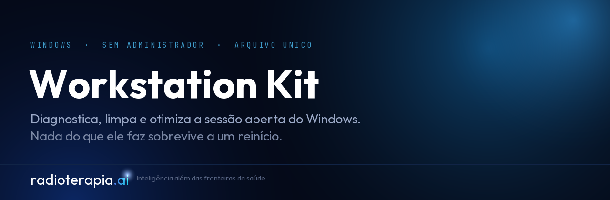
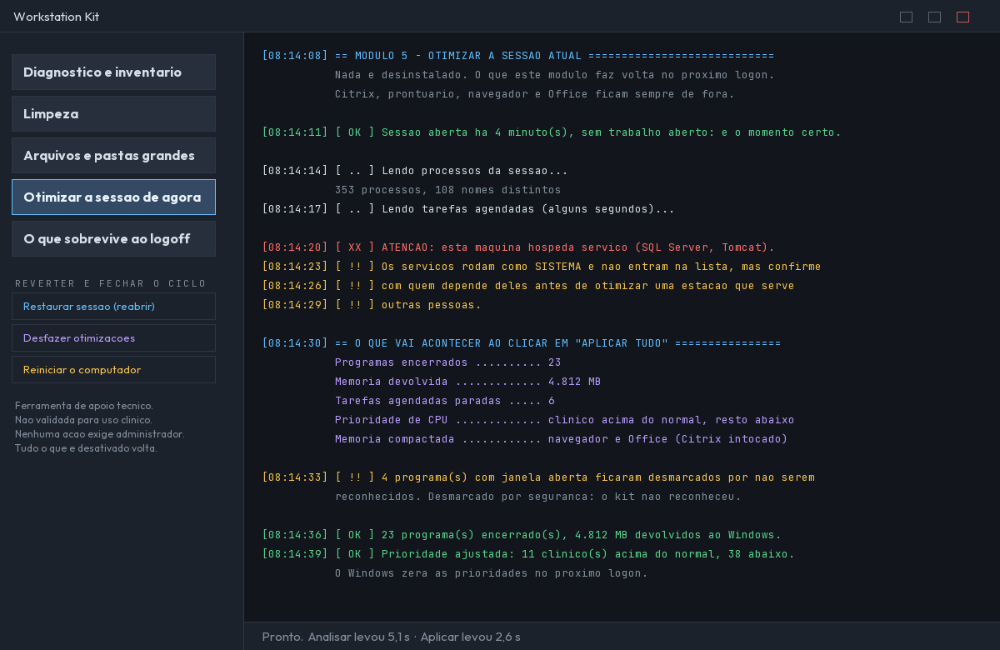

<p align="center">
  
</p>

# Workstation Kit

> **Support tool. Not validated for clinical use.**
> This is not a medical device. It does not diagnose patients, does not measure,
> does not interpret medical images and does not replace professional judgement.
> It is a Windows utility. See [NOTICE](NOTICE).

Diagnoses, cleans and optimizes the **open Windows session**. A single PowerShell
file, no installer, and **no administrator privilege required**.

Part of the **[Radioterapia.AI](https://radioterapia.ai)** ecosystem.

---

## What it is, and when to run it

It is a **Windows app**, not a radiotherapy app. It prepares the machine so the
day's work can start — which is why it is meant to run **right after you log in**,
before opening whatever you came to the computer to use.

Running it **in the middle of the day** can close work in progress. The app
measures that and says so: how long the session has been open, whether a batch is
running, and whether an application with an open window is already in use.

> The protection lists are the **net**, for anyone who runs it at the wrong time.
> The main mechanism is telling you the moment is wrong, with the reason in front
> of you, and letting you decide.

<p align="center">
  
</p>

## Nothing is permanent, except the files you choose to delete

| what | comes back through |
|---|---|
| closed processes, stopped tasks, CPU priority, compacted memory | the next logon |
| items removed from startup, performance tweaks | the **Undo** button |
| old Downloads | the Recycle Bin |
| temporary files and caches | they do not come back — that is the cleanup |

The Recycle Bin is emptied **first**, and what leaves Downloads goes into it
afterwards, which is why it remains recoverable.

**It does not uninstall anything.** When a program looks dispensable, the app
**ends the process** instead of uninstalling it: the memory comes back now, and at
the next logon everything is in place again. Detection that would require a
permanent action — a dead network mapping, an orphaned credential — comes out as a
**finding with the command**, for you to decide.

Every action group has a declared way back, and the test suite reads the
execution list from the source and fails if a new group appears without one.

## The modules

| | |
|---|---|
| **Diagnostics and inventory** | a portrait of the machine, and what can be resolved |
| **Large files and folders** | read-only; lists and gives a verdict |
| **Cleanup** | temporary files, caches, old Downloads |
| **Optimize the session** | closes what is not in use, adjusts priority, compacts memory |
| **Persistence** | what comes back on its own at every logon |

The log is the product: eight levels, each with its own colour, timestamps, and
the reason written next to every decision. What you see on screen is what you can
copy into a support ticket.

## What it will not do

- does not require administrator, in any function
- does not uninstall anything, does not touch `HKLM`
- does not delete files outside cache folders in your own profile — the large-file
  module lists and gives a verdict; **you** delete, through Explorer
- does not clean the registry: there is no published evidence of measurable gain,
  and there is real risk
- does not download anything and does not update itself
- does not work around antivirus software

## Protecting work in progress

The app carries lists of processes it will never close. They exist because this
tool was born inside a radiotherapy service, where closing the wrong process does
not mean an inconvenience — it means interrupting a treatment session.

Those lists cover treatment planning systems, record-and-verify systems, image
viewers, electronic health records, published-application clients, remote-access
tools used by IT, backup agents and corporate security agents, from several
vendors. They are the only part of this app that touches the medical world, and
they cost nothing to anyone who does not need them.

> The direction of the error is not symmetric. Protecting something that did not
> need it leaves dead weight. Failing to protect something that did interrupts
> someone's work. Doubt is resolved by protecting.

`docs/PENDENCIAS.md` lists, openly, what the coverage does **not** include yet.

## Status

Early. The application runs and the test suite is green, but the language layer
does not exist yet and there are list entries still to cover. This repository is
open so the work can be followed, not because it is finished.

## Running it

```
Start_WorkstationKit.cmd
```

Both files must sit in the same folder. PowerShell 5.1, Windows 10 or 11.

Before delivering any change:

```
powershell -NoProfile -ExecutionPolicy Bypass -File tools\Testar-Sessao.ps1
powershell -NoProfile -ExecutionPolicy Bypass -File tools\Verificar-Vazamento.ps1
```

---

## The ecosystem

**[Radioterapia.AI](https://radioterapia.ai)** is built across four layers, and
they are deliberately separate — what runs on a clinical workstation has different
constraints from what runs in a browser.

| layer | what lives there |
|---|---|
| **Web** — [radioterapia.ai](https://radioterapia.ai) | an **AI-first hub for medical skills**, and a hub for applications and community contributions. Expert Mode for professionals, Patient Information mode in 12 languages |
| **Local** | tools that run on the clinic's own machine, where the data never leaves: this kit, auto-contouring, local pseudonymization |
| **Mobile** | Android in the room — [PhotoID RT](https://github.com/radioterapia-ai/photoid-rt) |
| **Hugging Face** | what needs heavy dependencies a common user should not have to install, for quick use in the browser — POP de Elite runs there |

The web layer is where the community comes in: list your app, share your
repository, or deploy with us. See **[radioterapia.ai/about](https://radioterapia.ai/about)**.

## Who builds this

**Radioterapia.AI** — *Inteligência além das fronteiras da saúde.*

**Dr. Henrique Faria Braga** — Medical Skills & Apps. Radiation oncologist with
more than ten years building automation for operational and managerial workflows
in radiation therapy, and the originator of Radioterapia.AI. Medicine at FMUSP,
residencies in Internal Medicine and Radiation Oncology at USP. Head of the
Radiation Therapy team at Rede Américas and Medical Coordinator of Oncology at
Centro Médico Samaritano Barra da Tijuca, Rio de Janeiro.
CREMESP 129263 · CREMERJ 52-111804-8 · RQE-SP 54873 · RQE-RJ 331440 · CNEN CB-8319

**Fís. Lucas Brito** — Physics Scripts & Architecture, **co-founder**. Medical
physicist with a doctorate in Medical Physics, responsible for the platform's
technical architecture and AI tooling. He registered the domain and runs the
infrastructure that put the web ecosystem online.

### Links

| | |
|---|---|
| Website | [radioterapia.ai](https://radioterapia.ai) · [about](https://radioterapia.ai/about) |
| Instagram | [@radioterapia.ai](https://www.instagram.com/radioterapia.ai/) · [@radioterapiabr](https://www.instagram.com/radioterapiabr/) · [@podirradiar](https://www.instagram.com/podirradiar/) |
| LinkedIn | [Henrique Braga](https://www.linkedin.com/in/henriquefbraga/) · [Lucas Brito](https://www.linkedin.com/in/lucassbrito/) |
| Personal site | [drhenriquebraga.com.br](https://drhenriquebraga.com.br/) |

---

## Licence and name

The source code is released under the **[Apache License 2.0](LICENSE)**.

Two things travel with it and are not optional:

- **[NOTICE](NOTICE)** — section 4(d) of the licence requires it to accompany every
  redistribution. It carries the declaration that this is not validated for
  clinical use.
- **The name is not licensed.** Section 6 grants no trademark rights:
  "Radioterapia.AI" and "Workstation Kit", and their logos, may not be used to
  identify derived products.

Copyright © 2026 Henrique Faria Braga. Radioterapia.AI is a trade name and a
website, not a legal entity.

Learn more at **[radioterapia.ai](https://radioterapia.ai)**.
